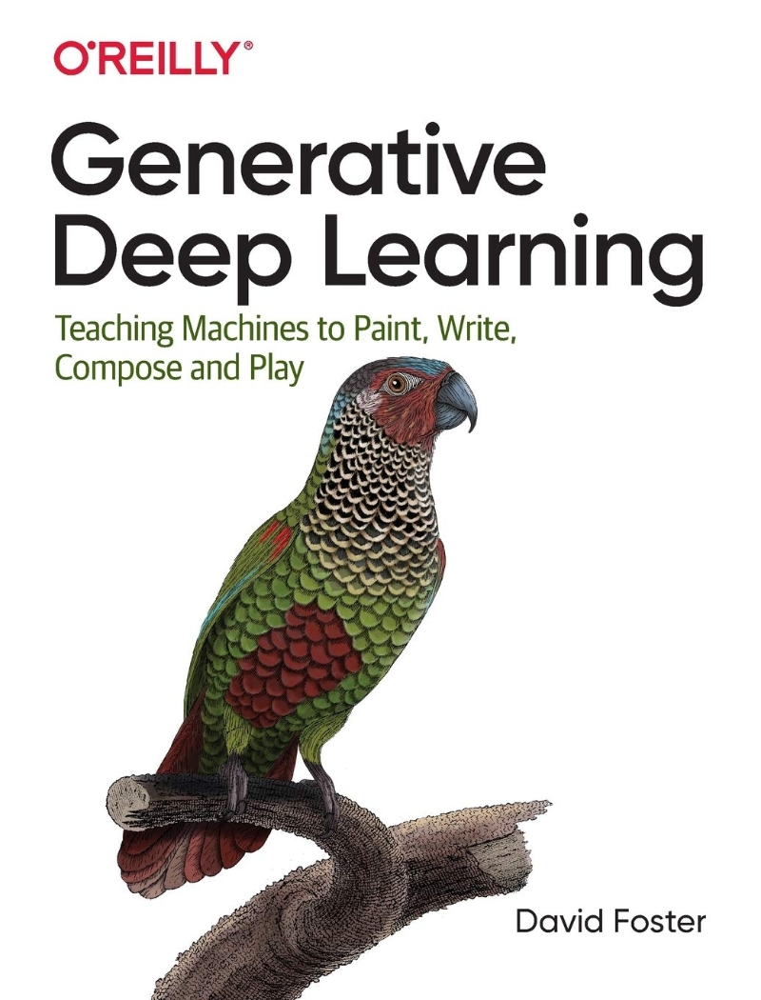

# Generative_Deep_Learning

데이비드 포스터의 'Generative Deep Learning' 교재를 학습한 후 코드 실습한 내용을 담았습니다.

## Chapter 3. 변이형 오토인코더(VAE)

3.2. AE(AutoEncoder)
3.4 VAE 만들기
3.5 VAE 사용하여 얼굴 이미지 생성

## Chapter 4. GAN(Generative Adversarial Network)

4.3. 첫 번째 GAN
4.5. WGAN